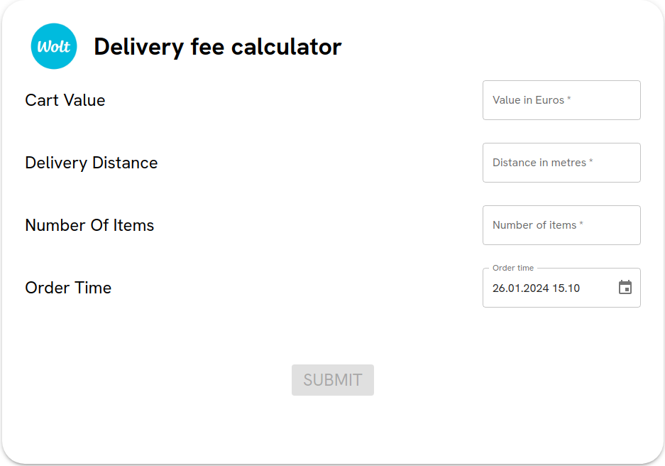
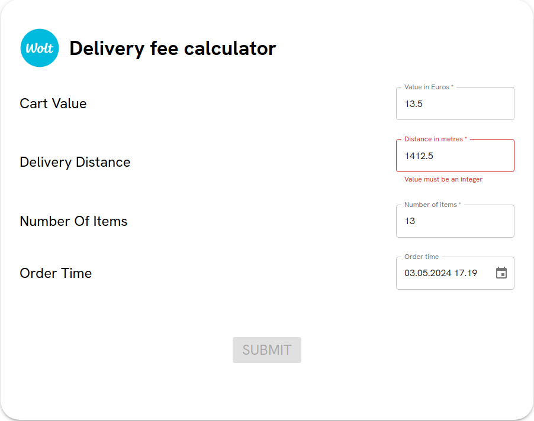
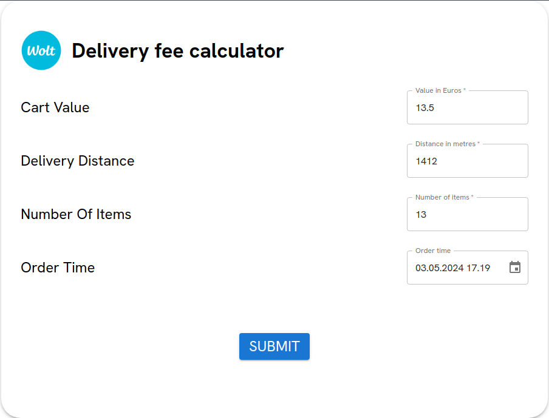
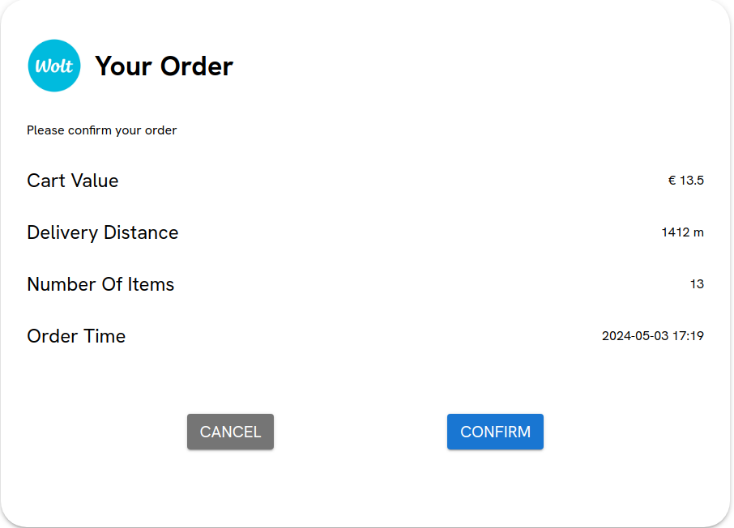
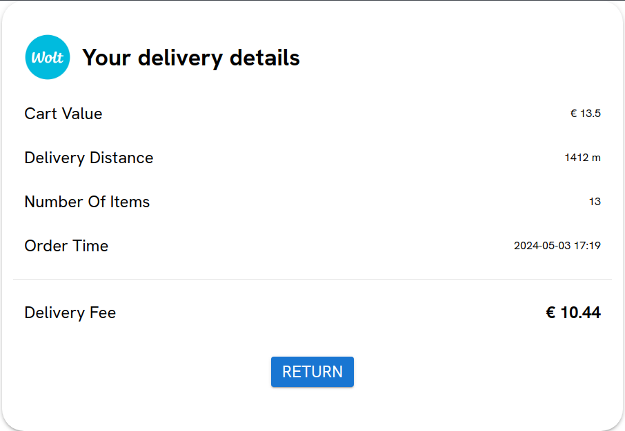
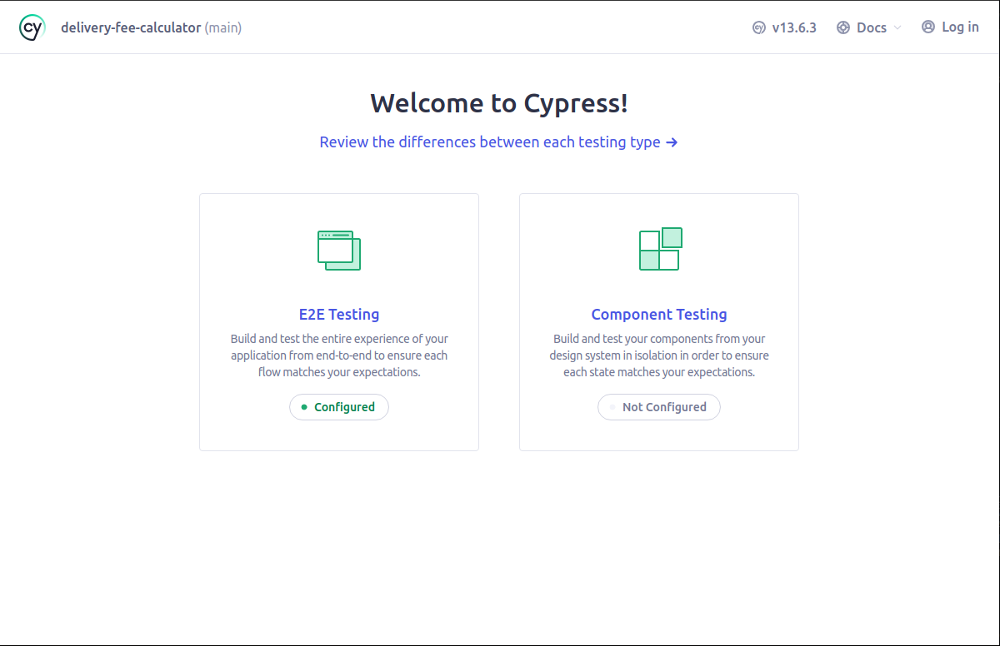
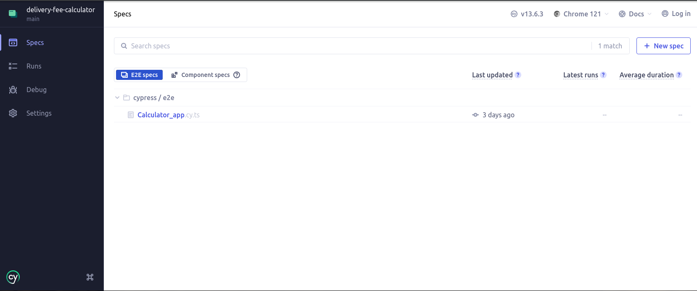

<a name="readme-top"></a>

<!-- PROJECT SHIELDS -->

[![LinkedIn][linkedin-shield]][linkedin-url]


<!-- PROJECT LOGO -->
<br />
<div align="center">
  <h3 align="center">Delivery fee calculator</h3>

  <p align="center">
    Calculate the delivery fee with simple clicks
    <br />
    <br />
    <br />
  </p>
</div>


<!-- TABLE OF CONTENTS -->
<details>
  <summary>Table of Contents</summary>
  <ol>
    <li>
      <a href="#about-the-project">About The Project</a>
      <ul>
        <li><a href="#built-with">Built With</a></li>
      </ul>
    </li>
    <li>
      <a href="#getting-started">Getting Started</a>
      <ul>
        <li><a href="#prerequisites">Prerequisites</a></li>
        <li><a href="#installation">Installation</a></li>
      </ul>
    </li>
    <li><a href="#roadmap">Roadmap</a></li>
    <li><a href="#license">License</a></li>
    <li><a href="#contact">Contact</a></li>
    <li><a href="#acknowledgments">Acknowledgments</a></li>
  </ol>
</details>


<!-- ABOUT THE PROJECT -->
## About The Project



This is a simplified delivery fee calculator. User can type in the value of products, the distance of the delivery, the total number of products, and finally the favourable order time, to calculate the fee for delivering all the products. Users also have the chance to change the data if needed before calculating the final fees.

The calculator follows the following rules when calculating the fee:

  - If the cart value is less than 10€, the difference between cart value and 10€ is added as surcharge.
  - All orders within 1000 meters are charged a basic delivery fee of 2€. An additional 1€ is charged for every additional 500 meters. Additional distance less than 500 meters is rounded **up** and counted as full 500 meters.
  - If there are five or more items, each item above and including the fifth one is charged 50 cents. If the total number of items is more than 12, a separate 1,2€ is charged in addition to the surcharge for each item.
  - For orders whose order time is between 3 p.m. and 7 p.m. on Friday, the total fee is multiplied by 1.2.
  - The maximum possible delivery fee is 15€.
  - All orders with a cart value of more than 200€ enjoy free delivery.

When first loaded, the user is prompted to the front page to type in information. Note that the submit button is disabled at first. It will automatically be enabled once all input fields have received proper inputs. 

After clicking the submit button, the user is prompted to confirm the input or cancel and re-enter the information.

If user choose to confirm the order, a new page will show up with the confirmed information and the final delivery fee. User can then choose to return to the front page by pressing the return button.

<p align="right">(<a href="#readme-top">back to top</a>)</p>


### Built With

* [![Vite][Vite]][Vite-url]
* [![React][React.js]][React-url]
* [![Redux][Redux.js]][Redux-url]
* [![React-Router][React-Router]][React-Router-url]
* [![MaterialUI][MaterialUI]][MaterialUI-url]
* [![Eslint][Eslint]][Eslint-url]
* [![Prettier][Prettier]][Prettier-url]
* [![Jest][Jest]][Jest-url]
* [![Testling-Library][testing-library]][testing-library-url]
* [![cypress][cypress]][cypress-url]


<p align="right">(<a href="#readme-top">back to top</a>)</p>


<!-- GETTING STARTED -->
## Getting Started

This frontend is deployed on [Render](https://delivery-fee-calculator-cx83.onrender.com). **Note: The website is deployed using a free CPU thus it will take some time for the page to load!** However, you could still try it locally. There are two options to deploy the project locally. The recommended way of deployment is to use the Docker image provided in this project. However, it is also possible to try out the project without Docker. This project follows the Test-driven Development ([TDD](http://www.butunclebob.com/ArticleS.UncleBob.TheThreeRulesOfTdd)) practice. There are different types of tests in the project. Detailed instructions on how to run them are provided later.

### Prerequisites

In order to run this project locally, Node.js is needed. Please have a look at the [official website](https://nodejs.org/en/download) and install the latest LTS version Node 20. The Docker file provided has Node configured. Therefore, if you choose to use Docker, you don't need to install Node locally to start the webpage. Instead, it is required that you have docker installed on your machine. To install Docker, please have a look at the official installation guide at [Get Docker](https://docs.docker.com/get-docker/).

However, please note that if you want to run the e2e tests provided in the project, you still need to install Node locally even if you want to use Docker.


### Installation

#### Using Docker

1. Make sure that you have successfully installed Docker on your machine and it can work properly. If this is not possible, please skip to <a href="#using-own-machine">Using own machine</a>.

2. At the root directory, run the following command to start the web page
    ```sh
    docker compose -f docker-compose.yml up --build
    ```
    The command will build an image and a container to run the webpage. Please note that the build process may take some time. Once the build process is finished, you should see information like the following appears in the terminal:
    > INFO Accepting connections at http://localhost:3000
    
    After the aforementioned message has appeared, you can open the webpage at http://localhost:5173.


3. After you've finished using the webpage, please use `Ctrl` + `c` in the same terminal that docker is running to stop the container.


4. To run the unit or integration tests accompanied with the project, use a different docker image and container than the previous mentioned one by running the following command
    ```sh
    docker compose -f docker-compose.dev.yml up --build
    ```
    The command will build a separate image and container to run the webpage. Please note that the build process may take some time. Once the build process is finished, you should see information like the following appears in the terminal:
    > VITE V5.0.12
    > 
    > -> Local: http://localhost:5173
    
    Note that the message will take around 10 seconds to show after the "Attaching to delivery-fee-dev" message has shown. This is done on purpose to avoid race issues.

    After the aforementioned message has appeared, you can open the webpage at http://localhost:5173.
    
    Use the following command
    ```sh
    docker compose -f docker-compose.dev.yml run --rm app npm run test
    ```
    This command will run all the tests and display outcomes in the terminal. After all tests have been run, the container created for the tests will be removed.


#### Using own machine

1. At the root directory, install all the dependencies used in this project
   ```sh
   npm install
   ```

2. **Method 1**
  Run the project with
   ```sh
   npm run build
   ```
   After the build has finished, run the following command
   ```sh
   npm run preview
   ```
   You should see messages like this after some time
   > vite preview
   >
   > -> Local: http://localhost:4173

   After you've seen this message, you can view the web page at http://localhost:4173. This is a preview of the production version of the webpage.

   After you've finished trying the webpage, use `Ctrl` + `c` in the terminal to stop the webpage.

   **Method 2** Run the project with
   ```sh
   npm start
   ```
   You should see something similar like this in your terminal:
   >VITE v5.0.12
   >
   >->Local: http://localhost:5173

   After seeing this message, you can open the webpage at http://localhost:5173. This method shows the development version of the webpage. After you've finished trying the webpage, use `Ctrl` + `c` in the terminal to stop the webpage.

3. To run all the tests for this project, use
   ```sh
   npm run test
   ```

#### Running e2e tests

To run the e2e tests, Node should be installed locally **regardless** of the methods chosen to run the webpage.

1. At the root directory, run

    ```sh
    npm install
    ```
    if hasn't been done before to install all packages needed

2. Start the webpage according to the method chosen.

    Docker:
    ```sh
    docker compose -f docker-compose.dev.yml up
    ``` 
    
    Own machine:
    ```sh
    npm start
    ```
    **Make sure that the webpage is actually running before moving on to the next step**

3. If you prefer to use an UI for the e2e tests, in a new terminal at the root directory, run

    ```sh
    npm run cypress:open
    ```
    This command will prompt a window similar to the following one:
    
    Choose E2E testing and choose Chrome as the browser, the next page should look similar to the following:
    
    Choose the test file to start running the e2e tests.
  
    Alternatively, in a new terminal under the same root directory, run
      ```sh
      npm run cypress:run
      ```
      to run all the e2e tests in the terminal.

<p align="right">(<a href="#readme-top">back to top</a>)</p>

<!-- ROADMAP -->
## Roadmap

See the [change log](./CHANGELOG.md) for a full list changes.

See the [reflection](./REFLECTION.md) for a reflection on the project, including technology choices, experience, and possible improvements.

<p align="right">(<a href="#readme-top">back to top</a>)</p>


<!-- LICENSE -->
## License

Distributed under the MIT License. See `LICENSE.txt` for more information.

<p align="right">(<a href="#readme-top">back to top</a>)</p>


<!-- CONTACT -->
## Contact

Chen Wang - [wang.756090@gmail.com](wang.756090@gmail.com)


<p align="right">(<a href="#readme-top">back to top</a>)</p>


<!-- ACKNOWLEDGMENTS -->
## Acknowledgments

* This project uses material provided in Wolt's [media kit](https://press.wolt.com/en-WW/media_kits/225299/).


<p align="right">(<a href="#readme-top">back to top</a>)</p>


<!-- MARKDOWN LINKS & IMAGES -->

[linkedin-shield]: https://img.shields.io/badge/-LinkedIn-black.svg?style=for-the-badge&logo=linkedin&colorB=555
[linkedin-url]: https://www.linkedin.com/in/msc-chen-wang/
[React.js]: https://img.shields.io/badge/React-20232A?style=for-the-badge&logo=react&logoColor=61DAFB
[React-url]: https://react.dev/
[Redux.js]: https://img.shields.io/badge/Redux-593D88?style=for-the-badge&logo=redux&logoColor=white
[Redux-url]: https://redux.js.org/
[React-Router]: https://img.shields.io/badge/React_Router-CA4245?style=for-the-badge&logo=react-router&logoColor=white
[React-Router-url]: https://reactrouter.com/en/main
[Eslint]: https://img.shields.io/badge/eslint-3A33D1?style=for-the-badge&logo=eslint&logoColor=white
[Eslint-url]: https://eslint.org/
[Prettier]: https://img.shields.io/badge/prettier-1A2C34?style=for-the-badge&logo=prettier&logoColor=F7BA3E
[Prettier-url]: https://prettier.io/
[Jest]: https://img.shields.io/badge/Jest-323330?style=for-the-badge&logo=Jest&logoColor=white
[Jest-url]: https://jestjs.io/
[MaterialUI]: https://img.shields.io/badge/MUI-%230081CB.svg?style=for-the-badge&logo=mui&logoColor=white
[MaterialUI-url]: https://mui.com/
[testing-library]: https://img.shields.io/badge/testing%20library-323330?style=for-the-badge&logo=testing-library&logoColor=red
[testing-library-url]: https://testing-library.com/
[Vite]: https://img.shields.io/badge/vite-%23646CFF.svg?style=for-the-badge&logo=vite&logoColor=white
[Vite-url]: https://vitejs.dev/
[cypress]: https://img.shields.io/badge/-cypress-%23E5E5E5?style=for-the-badge&logo=cypress&logoColor=058a5e
[cypress-url]: https://www.cypress.io/
